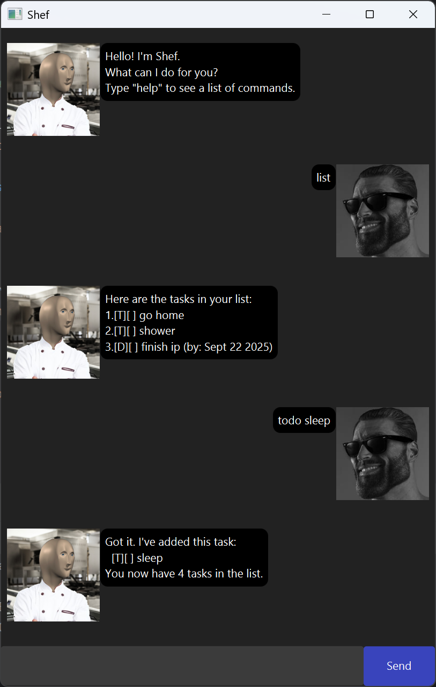

# **Shef** User Guide



# Shef is a chatbot that manages your tasks.

# Getting started
1. Ensure you have java 17 installed on your computer.
2. Download the latest jar from [<ins>here</ins>](https://github.com/gordontzx/ip/releases).
3. Copy the file to the folder you want to use as the home folder.
4. Open a command terminal and, `cd` into the folder containing the jar file you just downloaded, and run the following
command: `java -jar shef.jar` to start the application.

# Features

## Viewing help: `help`
Lists out all the available commands. <br/>
Usage: `help` <br/>
Expected output:
```
Here are the commands you can execute:
// list of commands
```

## Listing all tasks: `list`
Lists out all the tasks stored by the user. <br/>
Usage: `list` <br/>
Example output:
```
Here are the tasks in your list:
1.[T][ ] task 1
2.[T][ ] task 2
```

## Finding tasks by keyword: `find`
Finds tasks by the keyword in the task description.<br/>
Usage: `find KEYWORD` <br/>
<br/>
Example: `find book` <br/>
Example output:
```
Here are the matching tasks in your list:
1.[T][ ] borrow book
2.[T][ ] return book
```

## Adding a todo task: `todo`
Adds a todo type task. <br/>
Usage: `todo` <br/>
<br/>
Example: `add todo borrow book` <br/>
Example output:
```
Got it. I've added this task:
  [T][ ] borrow book
You now have 1 task in your list.
```

## Adding a deadline task: `deadline`
Adds a deadline type task that has a given deadline in YYYY-MM-DD format. <br/>
Usage: `deadline TASK_NAME /by YYYY-MM-DD` <br/>
<br/>
Example: `deadline shower /by 2025-12-31` <br/>
Example output:
```
Got it. I've added this task:
  [D][ ] shower (by: Dec 31 2025)
You now have 2 tasks in your list.
```

## Adding a event task: `event`
Adds an event type task which starts and ends at specified times. <br/>
Usage: `event TASK_NAME /from START /to END` <br/>
<br/>
Example: `event meeting /from 2pm /to 3pm` <br/>
Example output:
```
Got it. I've added this task:
  [E][ ] meeting (from: 2pm to: 3pm)
You now have 3 tasks in your list.
```

## Marking a task as done: `mark`
Marks a task as done by index. <br/>
Usage: `mark TASK_INDEX` <br/>
<br/>
Example: `mark 1` <br/>
Example output:
```
Nice! I've marked this task ad done:
  [T][X] borrow book
```

## Unmarking a task as done: `unmark`
Unmarks a task as done by index. <br/>
Usage: `unmark TASK_INDEX` <br/>
<br/>
Example: `unmark 1` <br/>
Example output:
```
Ok. I've marked this task as not done yet:
  [T][ ] borrow book
```

## Deleting a task: `delete`
Deletes a task by index. <br/>
Usage: `delete TASK_INDEX` <br/>
<br/>
Example: `delete 2` <br/>
Example output:
```
Noted. I've removed the task:
  [D][ ] shower (by: Dec 31 2025)
You now have 2 tasks in the list.
```

## Exiting the app: `bye`
Exits and closes the app. <br/>
Usage: `bye` <br/>
Expected output:
```
bye!
```